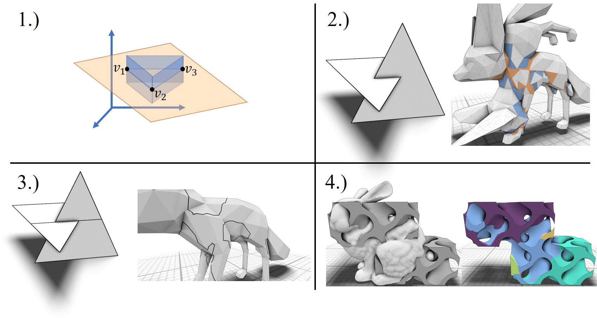
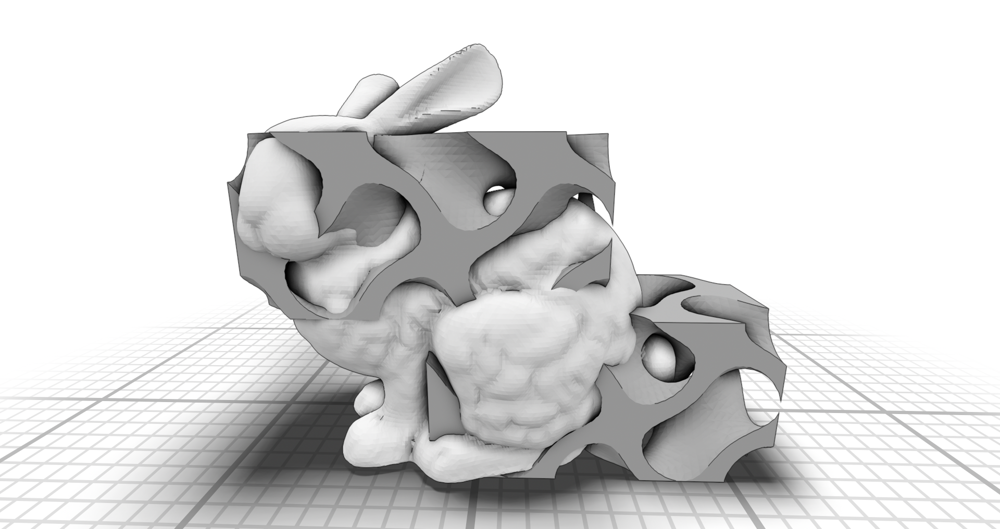
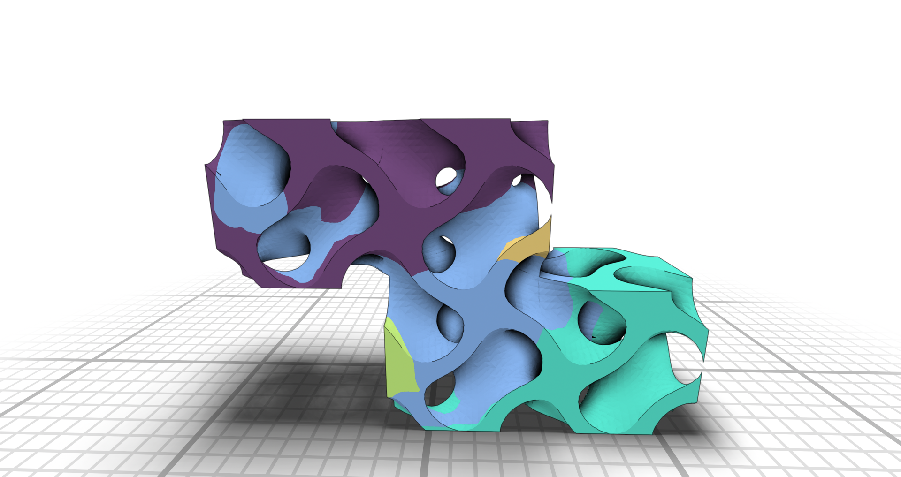
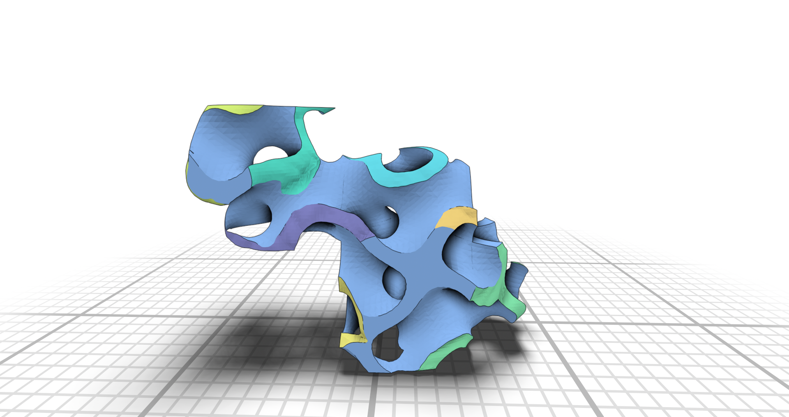
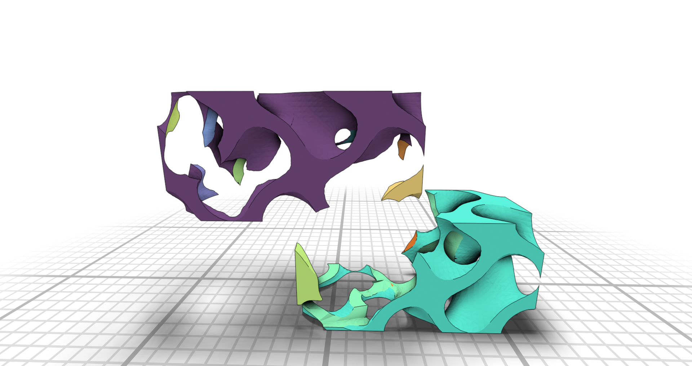
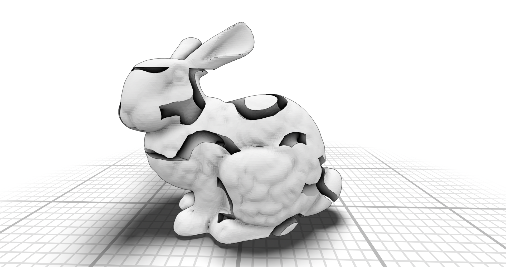
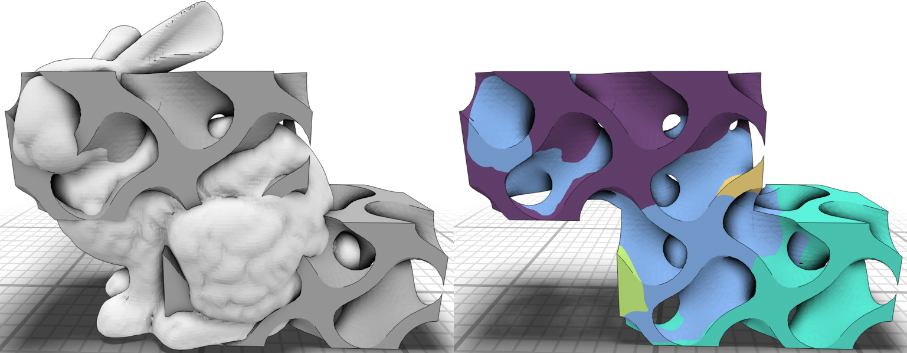
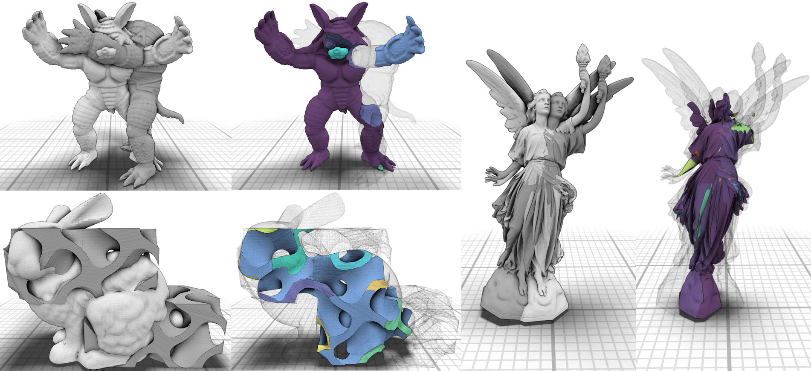

# Stable Plane-Based Constructive Solid Geometry

## Overview

This project presents a robust implementation of Constructive Solid Geometry (CSG) operations for polygonal meshes using exact integer arithmetic. CSG is a fundamental technique in computer graphics, CAD, and simulation applications that allows combining simple geometric objects through Boolean operations to create complex structures.

## Key Features

- **Exact Integer Arithmetic**: Eliminates floating-point round-off errors that plague traditional CSG implementations
- **Plane-Based Representation**: Guarantees robust splitting of convex polygons
- **Custom Intersection Tests**: Exact predicates for arbitrary convex polygons
- **Ray Casting Classification**: Determines inside/outside states for final CSG result
- **Octree Acceleration**: Optimizes intersection tests and ray casting operations

## Algorithm Pipeline

The CSG computation follows a four-stage pipeline as illustrated below:



1. **Plane-Based Polygon Representation**: Converts input meshes to plane-based polygon format
2. **Intersection Detection**: Identifies intersections between polygons from different meshes
3. **Polygon Splitting**: Divides intersecting polygons using exact arithmetic
4. **Result Generation**: Produces the final CSG result through face categorization

## Results Gallery

The following images demonstrate various CSG operations and their results:

| Overview | Result |
|----------|--------|
|  |  |
|  |  |
|  |  |



## Technical Approach

The implementation addresses the long-standing challenge of numerical robustness in CSG operations. By using exact integer arithmetic throughout the computation pipeline, the system avoids the accumulation of floating-point errors that can lead to topological inconsistencies in complex scenes with many intersections.

The plane-based geometry representation ensures that convex polygon splitting operations are mathematically sound, while the octree data structure provides efficient spatial acceleration for both intersection detection and ray casting operations.

## Academic Reference

For detailed technical information about the algorithms and implementation, please refer to my complete master's thesis:

**[A Fast and Stable Plane Based CSG Approach for Polygonal Meshes](https://drive.google.com/file/d/1nziD2g2Gce7c1YgGe14ETuS8T3oIrH8v/view?usp=sharing)**

## Building and Usage

The project uses CMake for building. External dependencies are included as git submodules in the `extern/` directory.

```bash
# Clone with submodules
git clone --recursive <repository-url>

# Build
mkdir build && cd build
cmake ..
make
```

Test meshes are provided in the `data/mesh/` directory for experimentation with different CSG operations.